

  

    BattleBang-HardwareKit-v1.0
  

  

    Jetson Holder + Target &amp; Blaster Kit for Unitree Go2
  

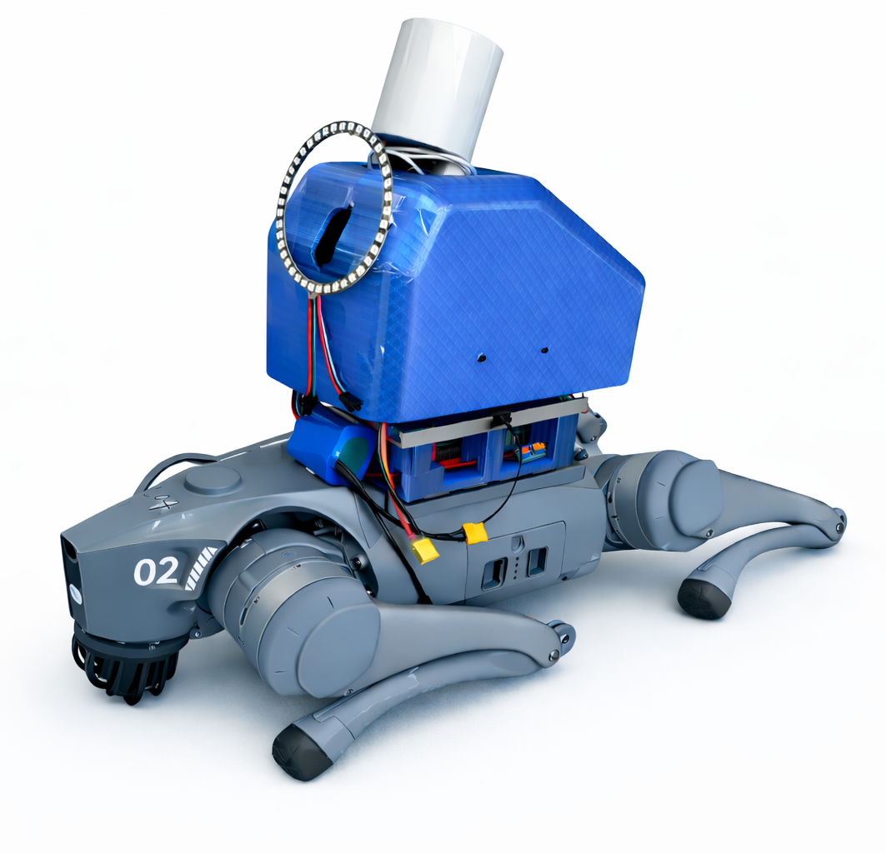

**Manual Version:** v1.0  
**Last Updated:** 2026-03-20  
**Kit Revision:** Hardware v1.0

**Manufacturer / Brand:** KongLabs  
**Author:** HWANG MooYeol

---

### ⚠️ Safety & Disclaimer (Quick)
- This kit includes **electronics and moving mechanisms**. Use proper tools and PPE.
- Use appropriate power sources and verify polarity before powering on.
- You are responsible for safe use and compliance with local regulations.

---

# What is BattleBang-HardwareKit?

BattleBang-HardwareKit-v1.0 is a modular hardware kit designed for **Unitree Go2**, providing three core modules:

- **Jetson Holder Module**: a mounting-ready holder system for Jetson integration on Go2  
- **Target Module**: impact-detection targets for gameplay-style hit registration on Go2  
- **Blaster Module**: a mounting-ready blaster mechanism to interact with targets in a BattleBang scenario

This manual covers the **recommended build order**, **required tools**, **printed parts**, **hardware list**, and **step-by-step assembly** for all modules.

## Details : File Package & Resources
- **Documentation (this manual):** `BattleBang-HardwareKit-v1.0.md`

- **3D printed parts (STL/STEP):** `[link or local folder path]`

- **BOM / Hardware list:** included in this manual (Section 3)

- **Firmware / Code (if applicable):** [GitHub repo](https://drive.google.com/drive/u/0/folders/1rs4Bfb1MO8zYlhwAnXwFB2mLnB4srzqd)

- **Release package:** `[ZIP / tag / version link]`

  <!-- ====================== Link 추가 ================ -->
  
  

# Hardware List (BOM)

This section lists the mechanical hardware required to assemble the kit.  
Quantities may vary by revision/option. Use this as a checklist.

## Conventions

>
> - **Fastener format:** `M3 × 10mm` = metric screw, 3mm diameter, 10mm length
> - If an item is optional, mark it as `Optional`.

## Jetson Holder Module — Hardware

| Ref   | Hardware         | Spec / Size     | Qty | Where Used / Notes |
|------:|------------------|-----------------|----:|--------------------|
| JH-001 | Screw           | M3 × 25mm       |  4  | Unitree Go2 back expansion board mounting |
| JH-002 | Heat-set insert | M3              |  4  | Unitree Go2 back expansion board insert |
| JH-003 | Screw           | M3 × 25mm       |  4  | Jetson holder bottom mounting |
| JH-004 | DC-DC converter | output :12V   |  1  | DC-DC 12V converter |
| JH-005 | LAN cable       | 400mm           |  1  | LAN cable |
| JH-006 | XT30 cable      | XT30 (female)   |  1  | XT30 female cable |
| JH-007 | Screw           | M3 × 10mm       |  2  | DC-DC converter mounting |
| JH-008 | Screw           | M3 × 15mm       |  4  | Jetson holder top mounting |
| JH-009 | Magnetic connector | 3-pin        |  1  | 3-pin magnetic connector |
| JH-010 | T-rail          | 200mm           |  2  | T-rail |
| JH-011 | Screw           | M4 × 20mm       |  6  | T-rail mounting screws |

---

## Blaster Module — Hardware

| Ref   | Hardware      | Spec / Size        | Qty | Where Used / Notes |
|------:|---------------|--------------------|----:|--------------------|
| BL-001 | T-slot       | 30mm               |  4  | Rail mounting (T-slot) |
| BL-002 | Screw        | M6 × 10mm          |  4  | T-slot fixing screws |
| BL-003 | Screw        | M3 × 15mm          |  4  | Angle plate mounting |
| BL-004 | Motor        | 130 motor          |  2  | Flywheel motors |
| BL-005 | Relay module | 2CH relay          |  1  | Blaster switch |
| BL-006 | Servo        | MG990R (360)       |  1  | Ball loader |
| BL-007 | Screw        | M3 × 30mm          |  4  | Ball shooter mounting |
| BL-008 | Cam          | Cam                |  1  | Ball pusher |
| BL-009 | Screw        | M3 × 10mm          |  3  | Cam holder mounting |
| BL-010 | Screw        | M3 × 20mm          |  1  | 130 motor holder mounting |
| BL-011 | Screw        | M3 × 10mm          |  4  | Relay mounting |
| BL-012 | Screw        | M3 × 15mm          |  4  | Servo offset mounting |
| BL-013 | Screw        | M3 × 10mm          |  4  | Servo mounting |
| BL-014 | Screw        | M3 × 10mm          |  1  | Ball loader mounting |
| BL-015 | PCB          | ESP board          |  1  | Control PCB (ESP board) |
| BL-016 | DC-DC converter | 12V → 5V         |  1  | Motor drive power (12V to 5V conversion) |

---

## Target Module — Hardware

| Ref   | Hardware        | Spec / Size        | Qty | Where Used / Notes |
|------:|------------------|--------------------|----:|--------------------|
| TG-001 | LED ring        | 12V (round)        |  1  | HP indicator |
| TG-002 | Piezo sensor module | 4-pin           |  2  | Hit detection (Optional: more can be added) |
| TG-003 | Screw           | M3 × 25mm          |  4  | Housing mounting |
| TG-004 | Battery         | 12V                |  1  | HW-side power source |
| TG-005 | Screw           | M3 × 10mm          |  4  | Piezo sensor mounting |

---

# Print List

## Jetson Holder Module — Print List

- **Unitree Go2 back expansion board**
- **Jetson holder bottom**
- **Jetson holder top**

## Blaster Module — Print List
- **Trail_base** ×2
- **angle** ×2
- **blaster bottom**
- **blaster top**
- **flywheel** ×2
- **flywheel cage**
- **motor holder**
- **servo offset**
- **servo loader**
- **magazine**

## Target Module — Print List
- **Housing (L)**
- **Housing (R)**
- **Piezo module holder** ×2

# Print Orientation

- Recommended Print Settings (All): at least three perimeters, 15–25% infill at 0.2mm layer height.
- **TPU (optional)** can be used for **vibration pads / flexible retainers** (only if your design includes TPU variants)
- **Support:** Some parts may require supports depending on overhangs and your STL variant.
- Needs support (likely): **blaster top** / **flywheel cage** (check overhangs in the slicer)
- **Brim:**
  - **Trail_base** (×2) will likely need a brim
  - **Housing (L/R)** may need a brim (if warping occurs)
  - **Jetson holder bottom** may or may not need a brim (depends on footprint/warp)

> These photos show print orientation and are not recommendations for how prints should be grouped for printing.

​            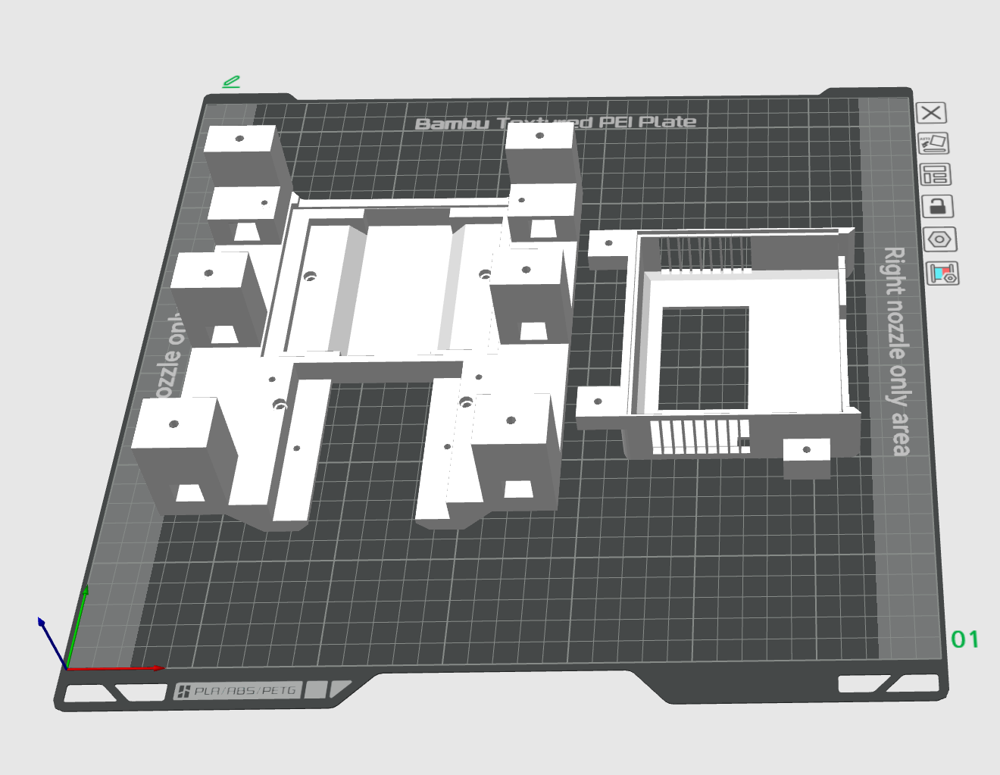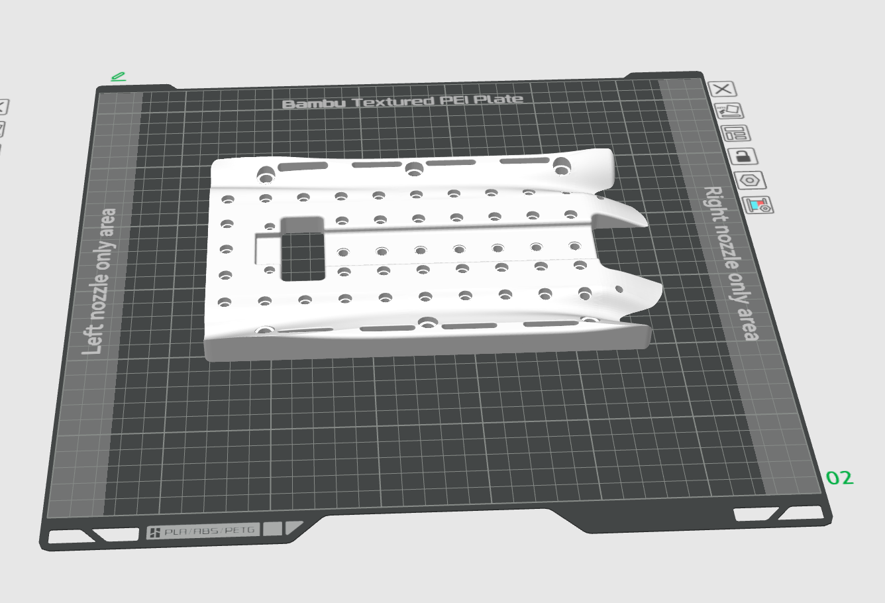

​            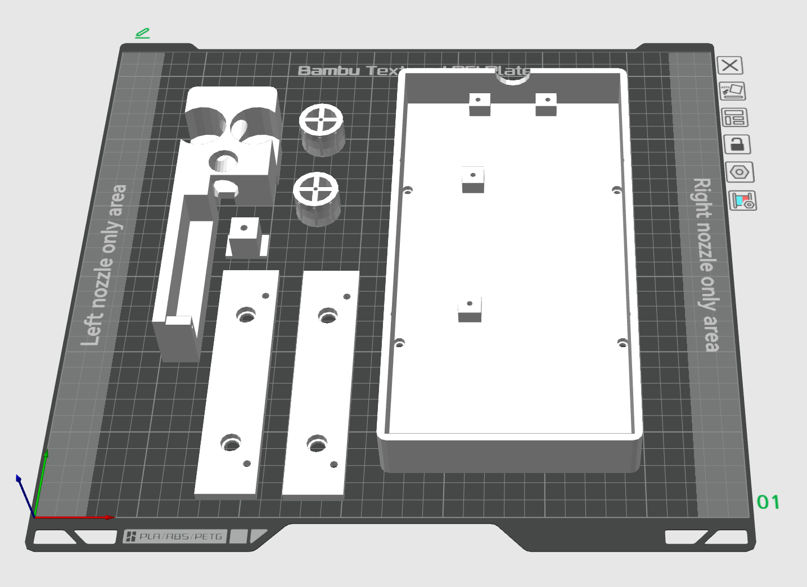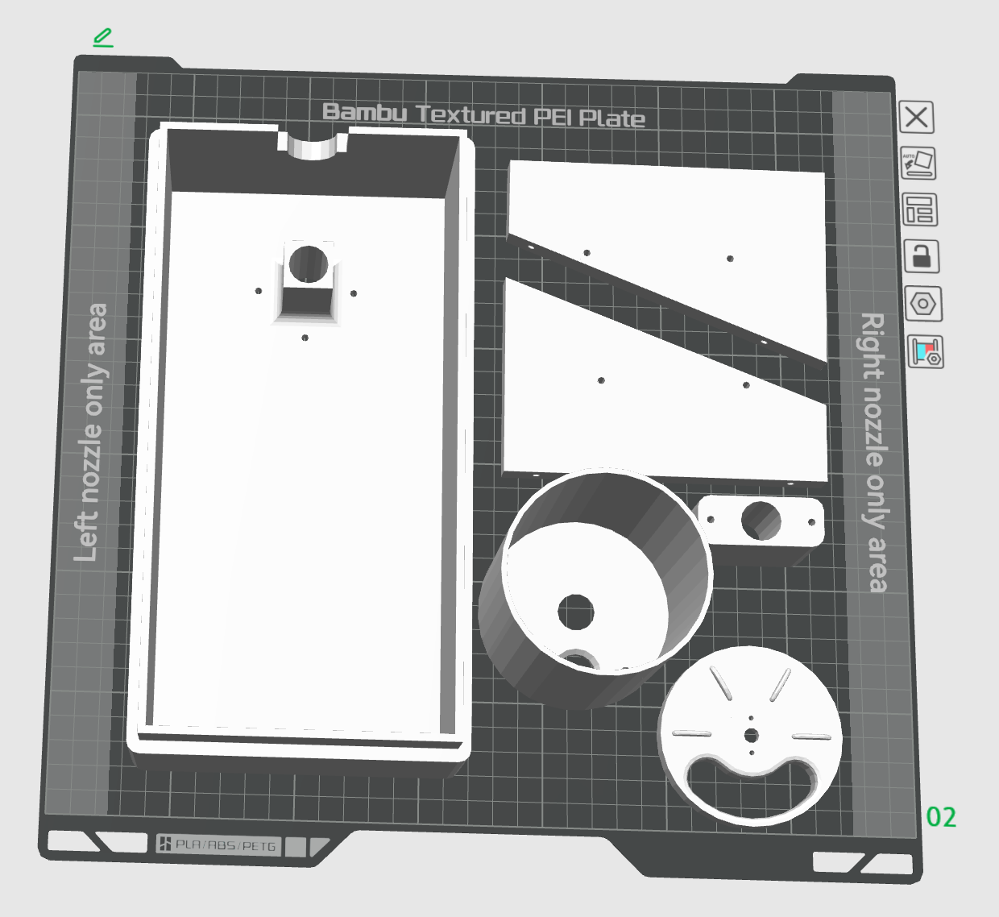

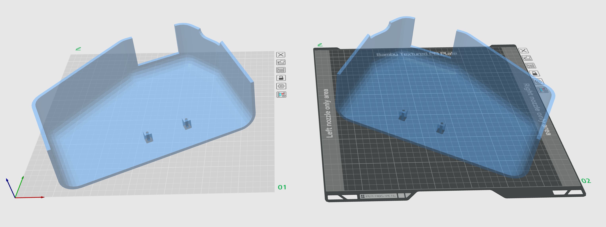

# Assembly Guide

> Build order: **Jetson Holder  → Blaster → Target**  
> Read each module section fully before starting.

## General Notes
- Do a **dry-fit** first before final tightening.
- Sort screws by length to avoid mix-ups.
- Do not overtighten into plastic. Tighten until snug, then stop.
- If using **heat-set inserts**: install inserts **before** final assembly where possible.

## Heat-Set Insert Guide (if applicable)
- Preheat soldering iron and use the correct tip for M3 inserts.
- Press inserts in **straight** and **flush** (do not tilt).
- Let the plastic cool fully before applying load.

---

# Jetson Holder Module — Assembly

## Step 1: Install four M3 heat-set inserts.

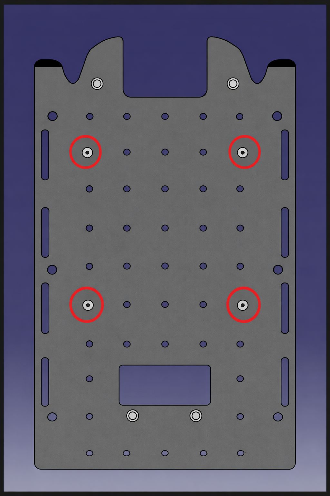

- Install **M3 heat-set inserts ×4** into the holes shown in the image (red circle).
- Press inserts in **straight and flush**.
- ⚠️ Caution: Do not tilt the inserts. Let the plastic cool fully before installing screws.

---

## Step 2: Mount the back expansion board to Go2.

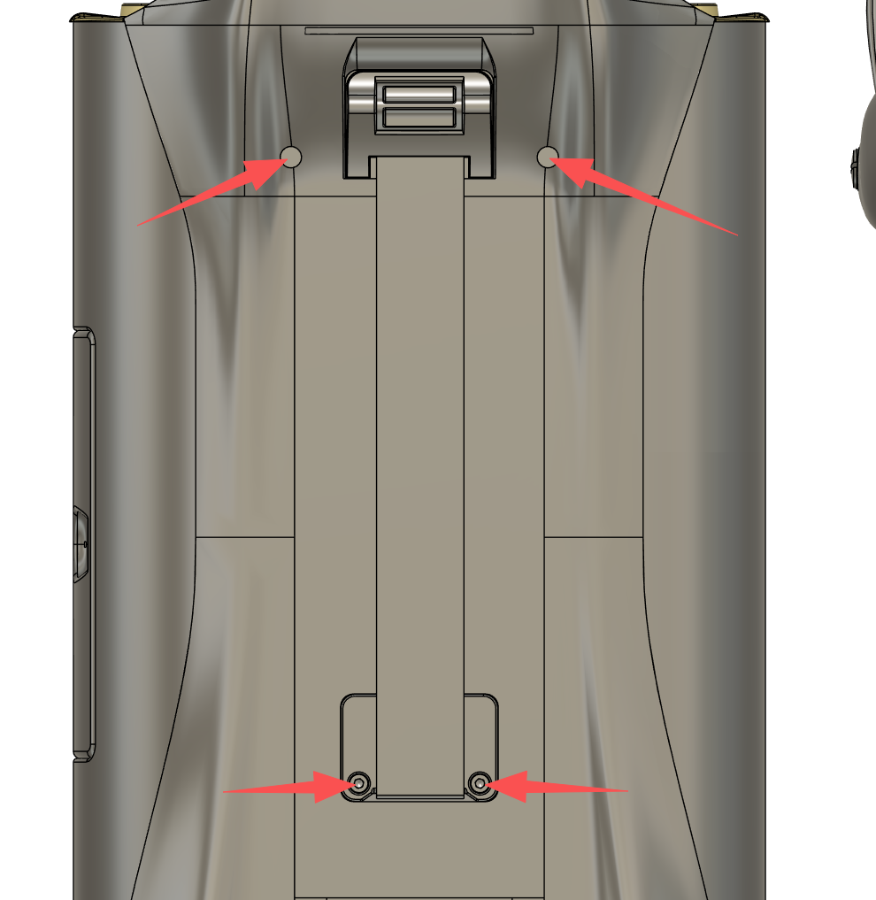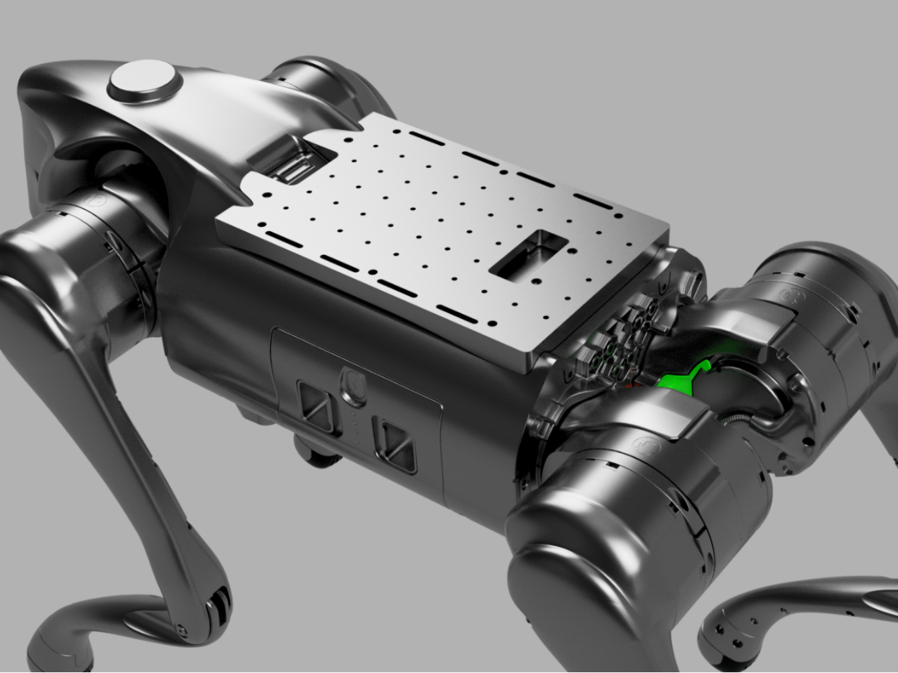   

- Place the **Unitree Go2 back expansion board** onto the Go2 top mount area as shown.
- Fasten using **M3 × 25mm screws ×4**.
- Check: Board sits flat, no wobble, and does not interfere with Go2 motion.

---

## Step 3: Attach Jetson holder bottom to the Go2 back expansion board.

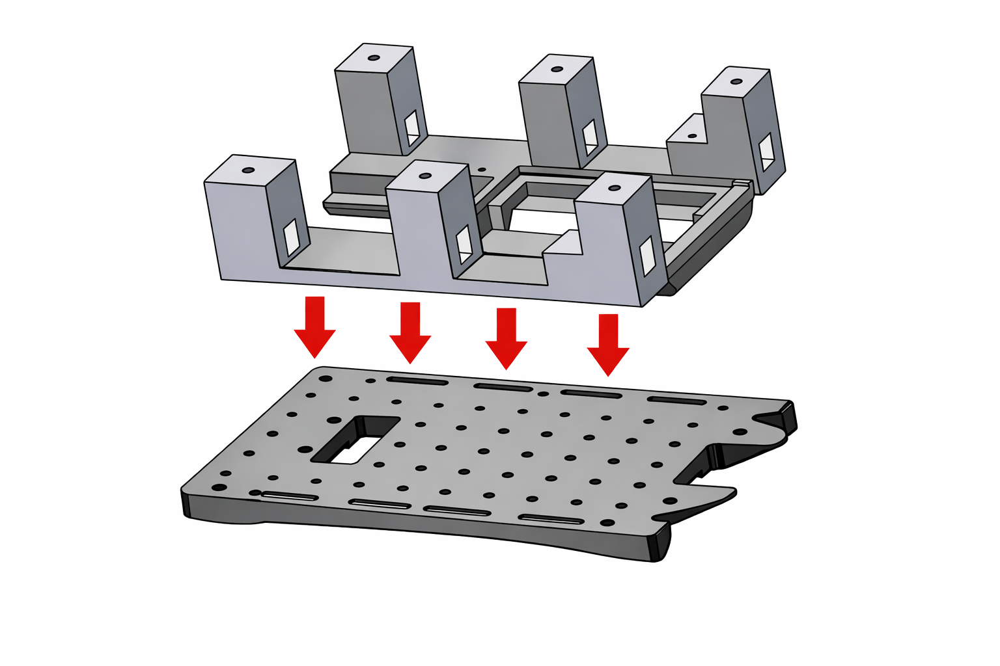

- Align **Jetson holder bottom** with the **Unitree Go2 back expansion board**.
- Attach using **M3 × 25mm screws ×4** through the four mounting holes.
- Check: Parts sit flush with no gaps and the assembly does not wobble.

---

## Step 4: Mount Jetson + DC-DC converter and connect cables.

- Mount the **Jetson** onto the Jetson holder.
- Mount the **DC-DC converter (12V)** onto the holder using **M3 × 10mm screws ×2**.
- Connect the **XT30 female cable** to the DC-DC converter input (12V side).
- Connect the **DC output connector** from the converter to the Jetson power input.
- Connect the **LAN cable (400mm)** to the Jetson Ethernet port.
- Check: All connectors are fully seated, cables have slack (no tension), and nothing is pinched by the holder.

---

## Step 5: Attach Jetson holder top to Jetson holder bottom.

- Align **Jetson holder top** with **Jetson holder bottom**.
- Attach using **M3 × 15mm screws ×4**.
- Check: The top cover closes without forcing, and no cables are pinched.

---

## Step 6: Mount the T-rails (200mm ×2) and secure.

- Position and mount **T-rail 200mm ×2** onto the Jetson holder assembly.
- Secure the rails using **M4 × 20mm screws ×6**.
- Check: Rails are parallel, fully seated, and do not wobble.

---

### Jetson Holder Module — Final Check
- All screws are tightened **snug** (no overtightening into plastic).
- T-rails are mounted straight and do not wobble.
- Jetson and DC-DC converter are securely mounted.
- XT30 / DC connector / LAN cable are fully seated with enough slack.
- No cables are pinched by the top cover.

---

# Blaster Module — Assembly

---

## Step 1: Shooter assembly (flywheel cage + cam + motors + flywheels).

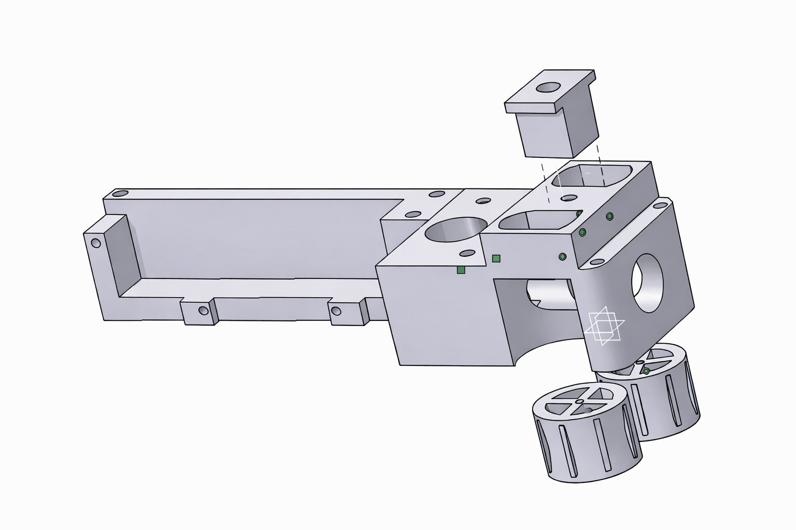

- Install the **cam** into the **flywheel cage**.
- Mount **130 motors ×2** into the **flywheel cage**.
- Press-fit / mount **flywheel ×2** onto the motor shafts.
- Secure the assembly using the **motor holder**.
- Check: Flywheels spin freely with no rubbing, and the cam rotates smoothly, and **verify motor polarity**.

---

## Step 2: Attach the shooter assembly to the blaster bottom.

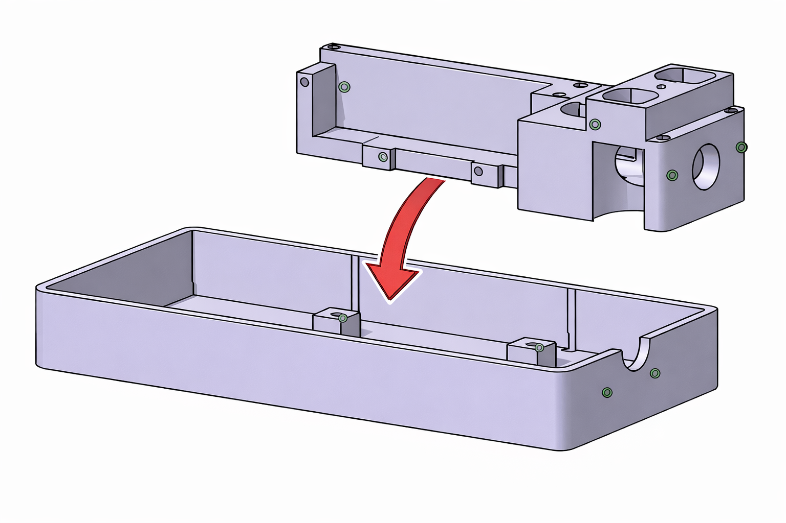

- Align the **shooter assembly** (from Step 1) with the **blaster bottom**.
- Seat the assembly fully into position.
- Secure using the designated mounting points on the blaster bottom.
- Check: Shooter sits flush with no wobble, and the flywheels can spin without interference.

---

## Step 3: Mount angle parts and Trail_base onto the blaster bottom.

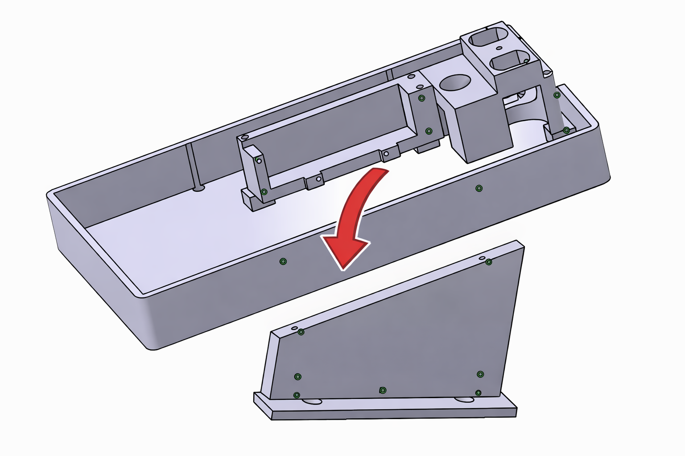

- Attach **angle ×2** to **Trail_base ×2**.
- Position **the assembly** on the **blaster bottom**.
- Secure using **M3 × 15mm screws ×4**.
- Check: Rail base is aligned, the frame is square, and nothing twists under light force.

---

## Step 4: Install the servo on the magazine and secure to the blaster top.

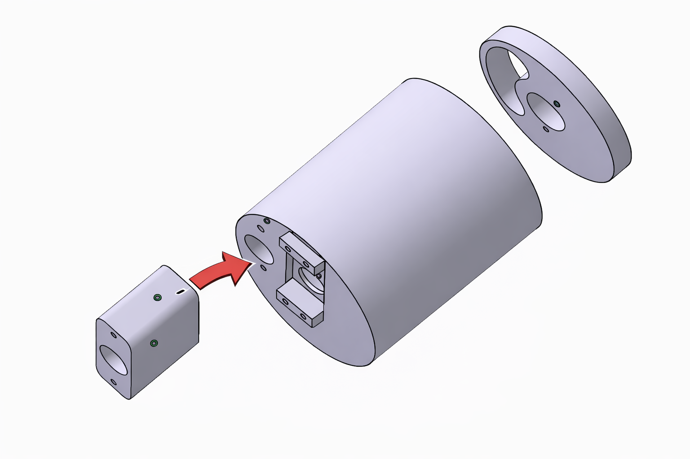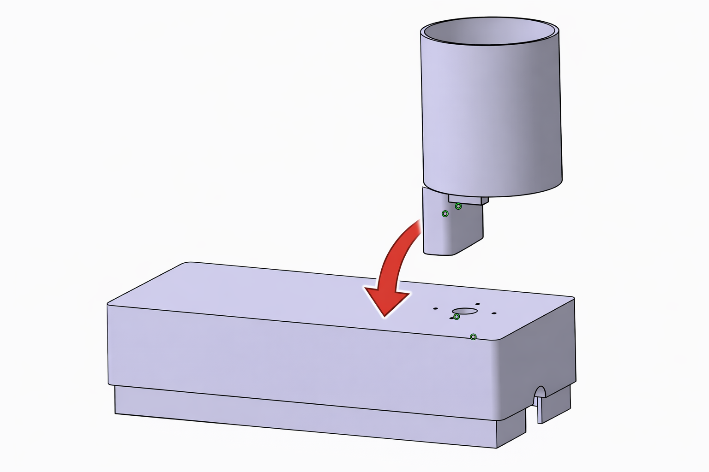

- Mount the **MG990R (360 servo)** onto the **magazine** using the **servo offset**.
- Install the **servo loader** onto the servo.
- Attach the magazine assembly to the **blaster top** and secure in place.
- Check: Servo is seated straight, the loader moves freely without binding, and wiring has enough slack.

---

## Step 5: Attach the blaster top to the blaster bottom.

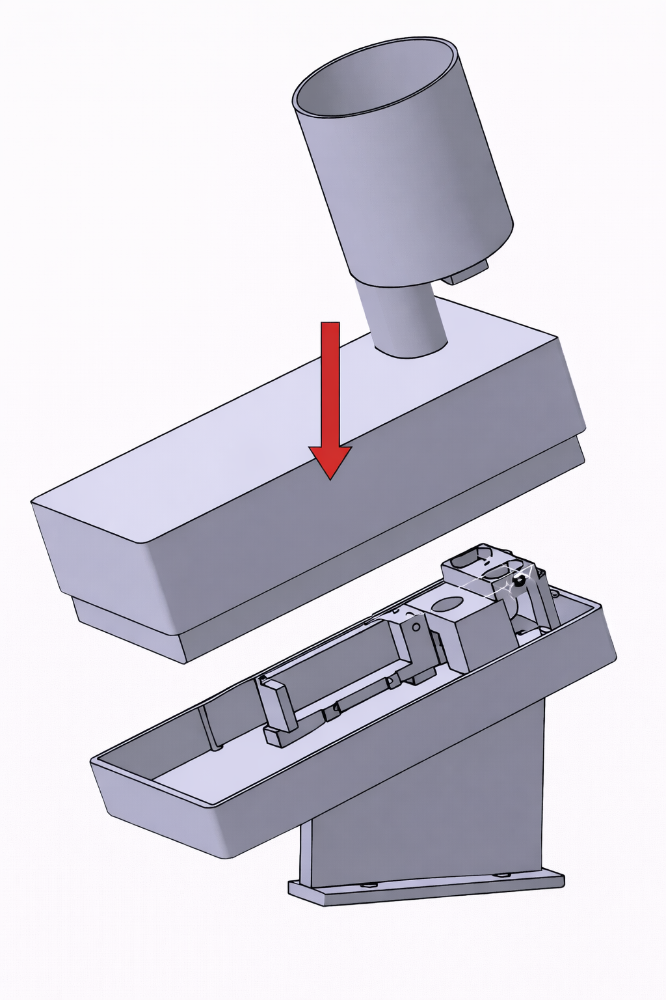

- Align the **blaster top** with the **blaster bottom**.
- Seat the parts fully and close the assembly.
- Check: No gaps along the seam, nothing is pinched inside, and moving parts still operate smoothly.

---

# Target Module — Assembly

---

## Step 1: Install the piezo modules into the piezo module holders.

- Prepare **Piezo module holder ×2**.
- Mount **4-pin piezo sensor modules ×2** into the holders.

---

## Step 2: Mount the piezo sensor modules into the target housing (L/R).

- Place **4-pin piezo sensor modules ×2** into **Housing (L)** and **Housing (R)**.
- Secure using **M3 × 10mm screws ×4**.
- Check: Modules are firmly seated and do not move when lightly pressed.

---

## Step 3: Attach the target housing (L/R) to the blaster module angle.

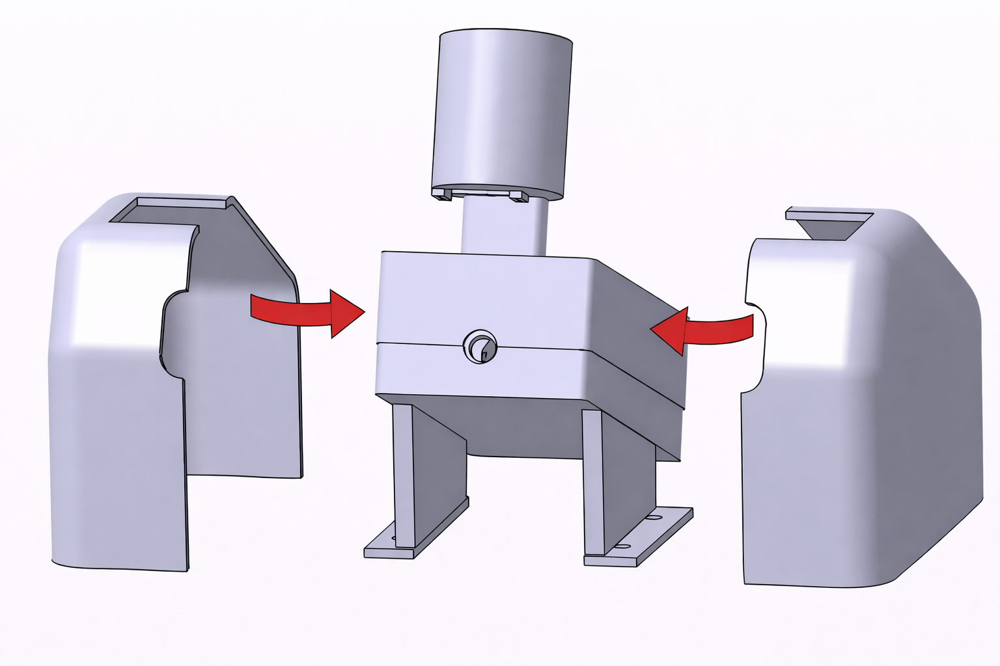

- Align **Housing (L/R)** with the **blaster module angle** mounting points.
- Attach and secure the housing in place.
- Check: Target is rigid (no wobble) and does not interfere with blaster operation.

---

## Step 4: Install the 12V LED ring.

- Install the **12V round LED ring ×1** for HP indication.
- Route the LED wires cleanly through the housing.
- Check: LED ring sits flat and is secured firmly (no rattle).

# Electronics / Wiring

> ⚠️ Power off before wiring.  
> Verify polarity before plugging any power connector.

---

## 1) Power Overview
- **12V Battery (Target HW power)** → supplies **Target LED ring (12V)** and **Piezo modules**
- **12V source** → **Target LED ring**
- **12V source** → **DC-DC 12V → 5V (Blaster)** → supplies **ESP board / relay / motors control side**

> If you are using a shared battery, confirm your harness and current capacity first.

---

## 2) Wiring

- 